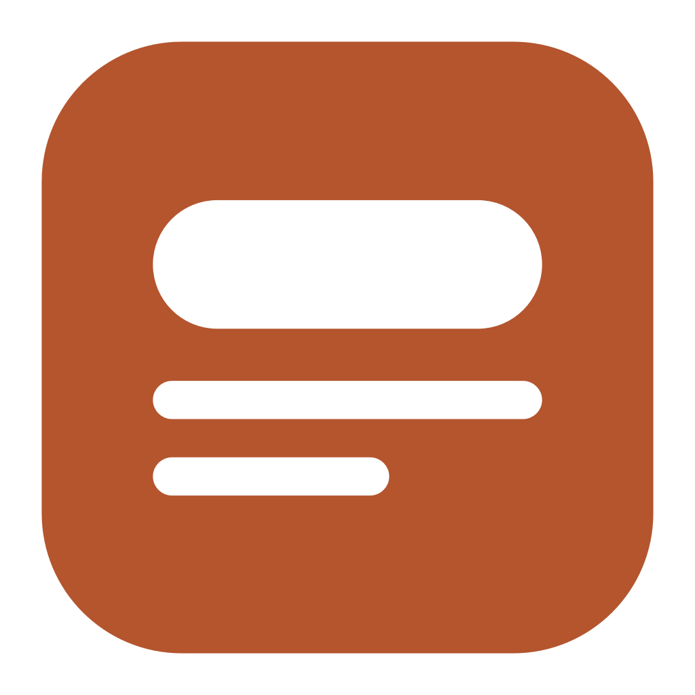

<p align="center">
  
</p>

<h1 align="center">Island</h1>

<p align="center">
  A floating macOS widget that drops your saved snippets into whatever input you're typing in.
</p>

<p align="center">
  <a href="https://souhaibbenfarhat.github.io/island"><strong>souhaibbenfarhat.github.io/island</strong></a>
</p>

---

Your email address, your signature, a ticket prefix, the standup template. They
live in a note you have to go and find, so you retype them from memory instead.

Island is a small bar that floats above every app. Click an item and its text
appears in the field your cursor is already in — no switching, no pasting.

## Features

- **One click, any app** — Mail, Slack, a browser form, a terminal. The island
  never takes focus, so the text goes where your cursor was
- **Floats everywhere** — drag it anywhere, on any Space, over full-screen apps
- **Collapses to a pill** when you want the pixels back, and hides completely
  from the menu bar
- **Placeholders** — `{{date}}`, `{{time}}`, `{{clipboard}}`, `{{uuid}}` and
  custom formats like `{{date:MMM d, yyyy}}`, expanded at the moment you click
- **Two insert methods** — paste (fast, restores your clipboard afterwards) or
  type it out key by key (never touches the clipboard)
- **Native SwiftUI** — tiny footprint, feels like part of macOS
- **Launch at login** toggle built in

## Install

```bash
brew install --cask souhaibbenfarhat/tap/island
```

Requires macOS 14+ (Apple Silicon). On first launch macOS asks you to allow
Island under **Privacy & Security → Accessibility** — that permission is what
lets any app send keystrokes to another one, and Island can't insert text
without it.

## How it works

The island is an `NSPanel` with the `.nonactivatingPanel` style, so clicking a
chip never makes Island the frontmost app — the text field you were writing in
keeps the keyboard. To insert, Island either:

- **pastes** — puts the text on the clipboard, posts a synthetic `⌘V`, then
  restores your previous clipboard a moment later, or
- **types** — posts the text as Unicode key events, in batches that never split
  an emoji in half, leaving the clipboard alone.

Your items are stored as plain JSON in
`~/Library/Application Support/Island/`. Island has no network code: nothing is
uploaded, and nothing is read except your own snippets file.

## Build from source

```bash
git clone https://github.com/SouhaibBenFarhat/island.git
cd island
scripts/build-app.sh          # produces dist/Island.app
open dist/Island.app
```

Run the unit tests with `swift test`. The logic that's worth testing —
snippets, placeholder expansion, persistence, panel geometry, Unicode batching
— lives in `IslandCore`, which has no AppKit dependency.

## License

MIT
